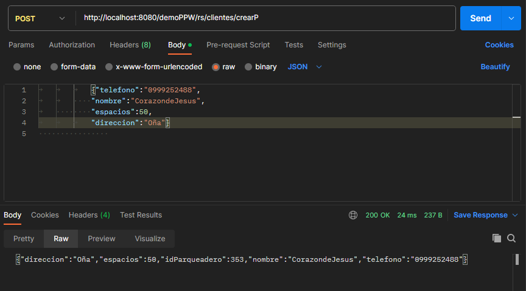

CREACION DEL SERVICIO

PRUEBA EN EL POSTMNAN

CORRECCION DEL SERVICIO

CREACION DEL SERVICIO DE CREAR PARQUEADEROS

EJECUCION EN EL POSTMAN

PRUEBA DEL GUARDADO EN LA BASE DE DATOS

CREACION DE SERVICIO WEB PARA ELIMINAR

IMPLEMENTACION DE LOS SERVICIOS EN VISUAL

PRUEBAS

CREAR UN CLIENTE

LISTAMOS EL NUEVO CLIENTE

EDITAMOS Y ACTUALIZAMOS

OBSERVAMOS LOS CAMBIOS EN LA LISTA

ELIMINAMOS EL CLIENTE

